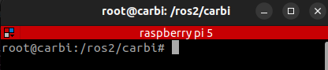
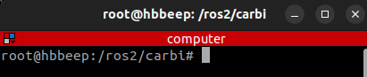
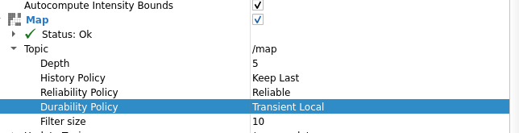
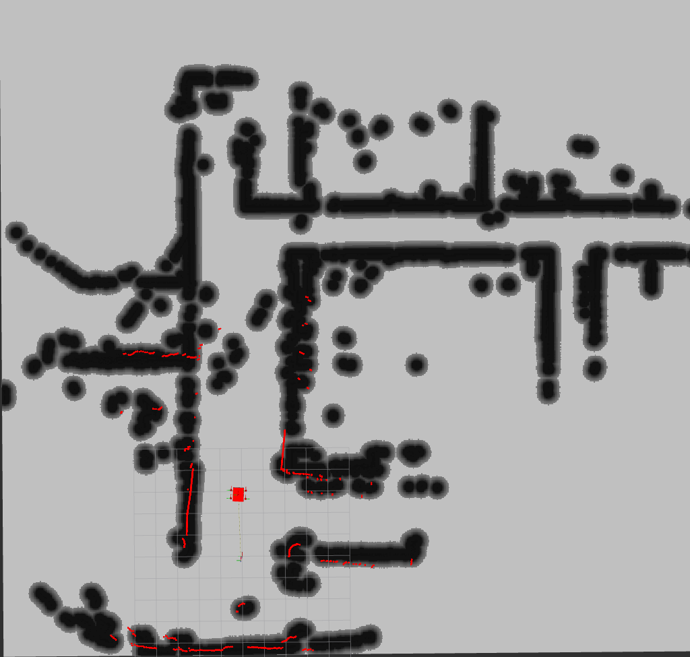
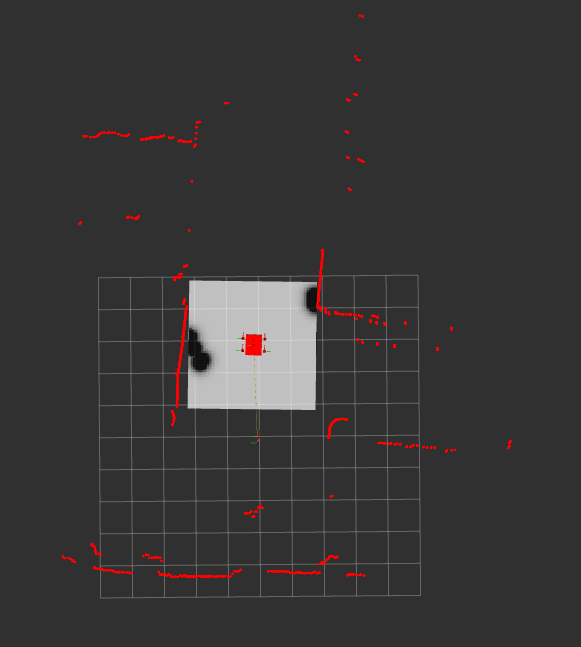

# CARBI _mecanum mobile robot_

## 📖 Description 

CARBI is a mecanum mobile robot equipped with an RPLidar mounted on top. In its current phase, CARBI can generate 2D maps using the RPLidar in conjunction with the slam_toolbox and navigate to specified points (go-to-goal). However, a persistent issue is the inaccurate yaw orientation of CARBI due to slippage of the mecanum wheels during turning, affecting the calculation of wheel odometry. Additional problems will be addressed in the following section topic [🔴 Problem](#problem) 


## 👍 Members
This project is a part of the FRA532 Mobile robotics course. Our team includes:

1. Kullakant Kaewkallaya
2. Thamakorn Tongyod


## ⚙️ Installation pre-requisite

### 0. Clone this repo to your folder and CARBI-1 will be your workspace 
```
git clone https://github.com/HBBEEP/CARBI-1.git
```

### 1. Clone this rplidar repo to your workspace
```
git clone https://github.com/babakhani/rplidar_ros2
```

### 2. Set Up CARBI environment with Docker 


```
cd ~/CARBI-1/docker
```

```
docker compose build # If your docker is not built
```

```
docker compose up -d
```
```
docker exec -it docker-ros2-1 bash
```
then RUN this command in root
```
cd ros2/carbi
```

**Note:**  If you are not familiar with Docker, please follow this tutorial (which I followed too :) )

-> https://www.kevsrobots.com/learn/learn_ros/04_docker_install.html 


### 3. remote to raspberry pi 5 by using
```
ssh carbi@[IPv4 of raspberry pi 5]  # example -> ssh carbi@99.9.999.99
```
**Note:** 
1. Don't forget to connect internet in raspberry pi 5
2. You can check the IPv4 address of raspberry pi 5 by using some tools like advance IP scanner program.
### 3. Run in terminal (your computer) to allow root access to the X server
```
xhost local:root
```

### -> raspberry pi 5 terminal


### -> your terminal


## 📡 Teleop

### Terminal 1 (remote to raspberry pi 5)

```
ros2 launch carbi_bridge carbi.launch.py
```

### Terminal 2 (remote to raspberry pi 5)

```
ros2 run carbi_control carbi_controller.py
```

### Terminal 3 (your computer or remote to raspberry pi 5 )
```
ros2 run teleop_twist_keyboard teleop_twist_keyboard
```

## Mapping


https://github.com/HBBEEP/CARBI-1/assets/75566343/b92c2808-803a-4ee5-97dc-06fca6750005


### Terminal 1 (remote to raspberry pi 5)

```
ros2 launch carbi_bridge carbi.launch.py
```

### Terminal 2 (remote to raspberry pi 5)

```
ros2 run carbi_control carbi_controller.py
```

### Terminal 3 (your computer)
```
ros2 run teleop_twist_keyboard teleop_twist_keyboard
```

### Terminal 4 (your computer)
```
ros2 launch carbi_navigation mapping.launch.py
```

**Note** : if map doesn't show -> change **Durability Policy** topic to _**Trasient Local**_



## 💡 Navigation (go to goal)


https://github.com/HBBEEP/CARBI-1/assets/75566343/29965f14-ad02-44ab-b117-75aa3aac5996


### Terminal 1 (remote to raspberry pi 5)

```
ros2 launch carbi_bridge carbi.launch.py
```

### Terminal 2 (remote to raspberry pi 5)

```
ros2 run carbi_control carbi_controller.py
```

### Terminal 3 (your computer) 
```
ros2 launch carbi_navigation navigation.launch.py
```

### Terminal 4 (your computer) 
```
ros2 launch carbi_navigation justdisplay.launch.py 
```

## Demo 

### Teleop

https://github.com/HBBEEP/CARBI-1/assets/75566343/67f60eaf-9dd0-44ad-a491-fbd2fea5e72d


### Go to Goal

https://github.com/HBBEEP/CARBI-1/assets/75566343/925398d9-09d5-472c-af4d-fc590bbdd2da


- Here is global cost map


- Here is local cost map



## 🔴 Problem

1. 
2. 
3. 


<p align="right">(<a href="#readme-top">back to top</a>)</p>
